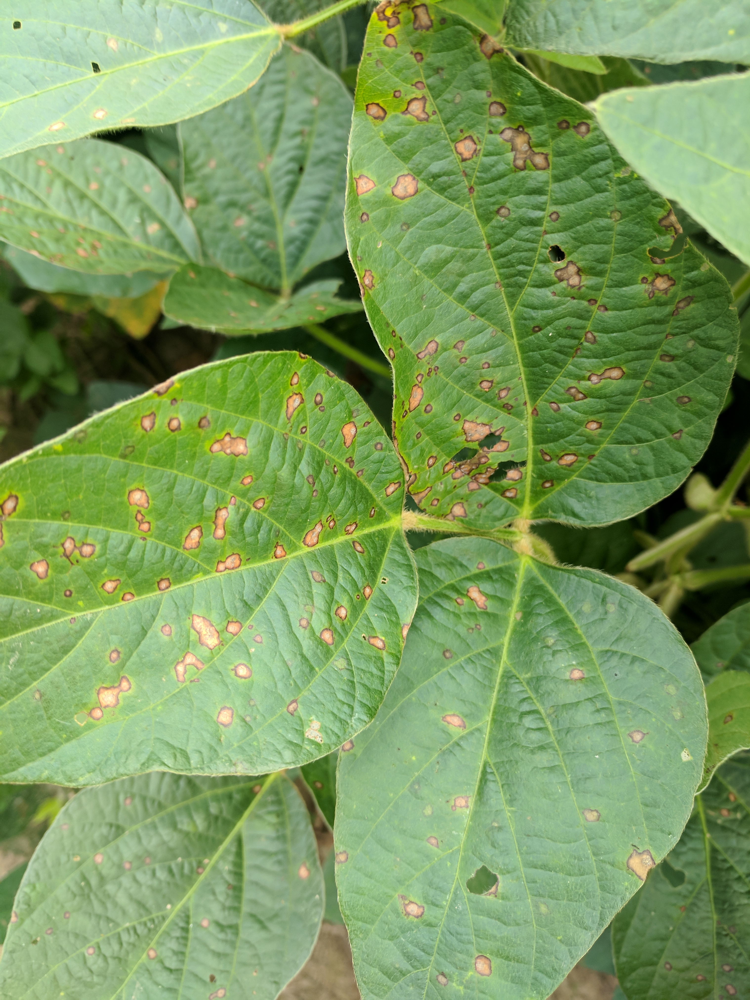

This website provides easy access to commented R scripts that allows reproducing the analysis of the data from our publication.

The present study summarized the relationship between soybean yield and frogeye leaf spot (FLS) severity, caused by *Cercospora sojina*, in United States using data obtained across 39 uniform field trials conducted over ten growing seasons (2012 - 2021) across a range of environments in eight soybean-producing states (Alabama, Arkansas, Illinois, Iowa, Kentucky, Louisiana, Mississippi and Tennessee). We also used a network meta-analytic approach to identify variables affecting this relationship, and, finally, estimated economic damage thresholds for different scenarios of soybean prices, fungicide costs and efficacies. This information is essential to estimate loss in yield at the field level due to FLS and to assist farmers with making informed decisions about disease management.

